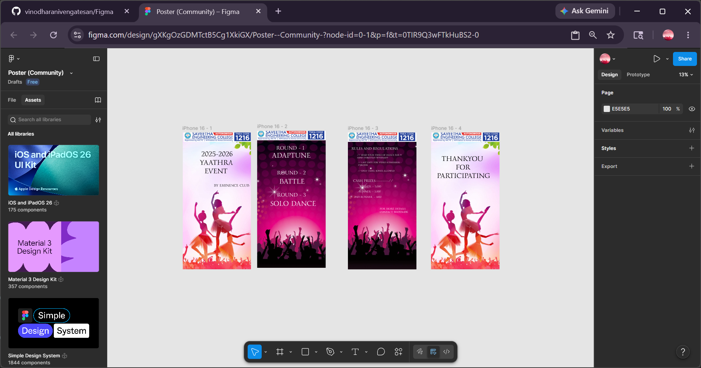

# Ex09 Event Registration Web Application
## Date:

## AIM:
To design, develop and deploy a web application for event registration.

## DESIGN STEPS:

### Step 1:
Create a new frame.

### Step 2:
Select any one preset size of your choice.

### Step 3:
Select the shapes you need.

### Step 4:
Import images as needed.

### Step 5:
Create pages based on your need and link them.

### Step 6:

Validate the HTML and CSS code.

### Step 6:

Publish the website in the given URL.

## DESIGN TOOL:
Figma

## CODE:
```
import image1 from "./image-1.png";
import image2 from "./image-2.png";
import image3 from "./image-3.png";

export const Iphone = (): JSX.Element => {
  const titleLines = ["YAATHRA", "EVENT"];

  return (
    <main
      className="bg-white overflow-hidden w-full min-w-[1239px] min-h-[2477px] relative"
      aria-label="Yaathra event poster"
    >
      
      
      
      <header className="absolute top-[314px] left-[337px] w-[825px]">
        <h1 className="[font-family:'Gideon_Roman-Regular',Helvetica] font-normal text-black text-9xl tracking-[0] leading-[normal]">
          2025-2026
        </h1>
      </header>
      <section
        className="absolute top-[469px] left-[calc(50.00%_-_394px)] w-[973px]"
        aria-label="Event title"
      >
        <h2 className="[font-family:'Gideon_Roman-Regular',Helvetica] font-normal text-black text-9xl tracking-[0] leading-[normal]">
          {titleLines.map((line, index) => (
            <span key={line}>
              {index === 0 ? "\u00A0\u00A0" : "\u00A0\u00A0\u00A0\u00A0"}
              {line}
              {index < titleLines.length - 1 && <br />}
            </span>
          ))}
        </h2>
      </section>
      <p className="absolute top-[920px] left-[564px] w-[886px] [font-family:'Gideon_Roman-Regular',Helvetica] font-normal text-black text-[64px] tracking-[0] leading-[normal]">
        BY EMINENCE CLUB
      </p>
    </main>
  );
};
```
```
/** @type {import('tailwindcss').Config} */
module.exports = {
  content: ["./src/**/*.{html,js,ts,jsx,tsx}"],
  theme: {
    extend: {},
  },
  plugins: [],
};
```
```
@tailwind base;
@tailwind components;
@tailwind utilities;

@layer base {
  button,
  input,
  select,
  textarea {
    @apply appearance-none bg-transparent border-0 outline-none;
  }
}

@tailwind components;
@tailwind utilities;

@layer components {
  .all-\[unset\] {
    all: unset;
  }
}

:root {
  --animate-spin: spin 1s linear infinite;
}

.animate-fade-in {
  animation: fade-in 1s var(--animation-delay, 0s) ease forwards;
}

.animate-fade-up {
  animation: fade-up 1s var(--animation-delay, 0s) ease forwards;
}

.animate-marquee {
  animation: marquee var(--duration) infinite linear;
}

.animate-marquee-vertical {
  animation: marquee-vertical var(--duration) linear infinite;
}

.animate-shimmer {
  animation: shimmer 8s infinite;
}

.animate-spin {
  animation: var(--animate-spin);
}

@keyframes spin {
  to {
    transform: rotate(1turn);
  }
}

@keyframes image-glow {
  0% {
    opacity: 0;
    animation-timing-function: cubic-bezier(0.74, 0.25, 0.76, 1);
  }

  10% {
    opacity: 0.7;
    animation-timing-function: cubic-bezier(0.12, 0.01, 0.08, 0.99);
  }

  to {
    opacity: 0.4;
  }
}

@keyframes fade-in {
  0% {
    opacity: 0;
    transform: translateY(-10px);
  }

  to {
    opacity: 1;
    transform: none;
  }
}

@keyframes fade-up {
  0% {
    opacity: 0;
    transform: translateY(20px);
  }

  to {
    opacity: 1;
    transform: none;
  }
}

@keyframes shimmer {
  0%,
  90%,
  to {
    background-position: calc(-100% - var(--shimmer-width)) 0;
  }

  30%,
  60% {
    background-position: calc(100% + var(--shimmer-width)) 0;
  }
}

@keyframes marquee {
  0% {
    transform: translate(0);
  }

  to {
    transform: translateX(calc(-100% - var(--gap)));
  }
}

@keyframes marquee-vertical {
  0% {
    transform: translateY(0);
  }

  to {
    transform: translateY(calc(-100% - var(--gap)));
  }
}
```

## OUTPUT:



## RESULT:
The program to design, develop and deploy a web application for event registration is completed successfully.
